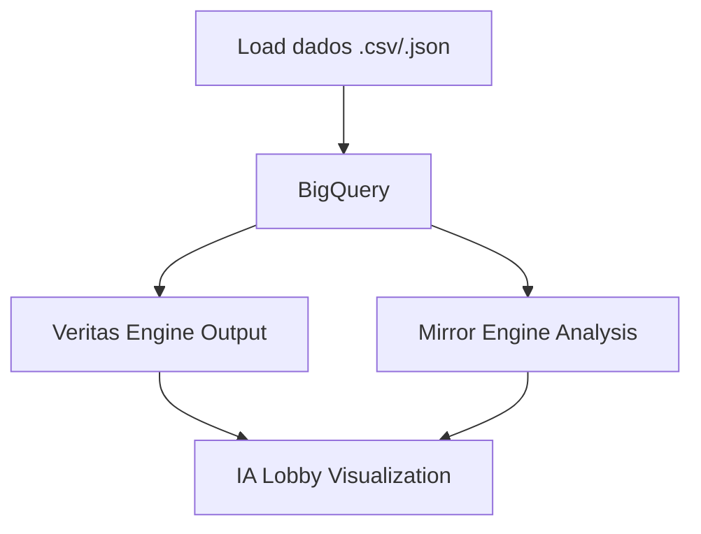

# FoundLab — Prova de Conceito (POC) de Infraestrutura Reputacional

## 🎯 Objetivo

Demonstrar a capacidade da FoundLab de transformar dados reputacionais em ativos computáveis, auditáveis e interoperáveis com plataformas institucionais, utilizando:
- Ingestão automatizada no GCP (BigQuery)
- Simulação de vereditos reputacionais
- Visualização via interface de agentes IA (IA Lobby)
- Repositório público GitHub-ready

---

## 🧱 Estrutura da POC

### 1. `x2`

**Função:** Prover pipeline de ingestão + dados reais + scripts para execução local e em cloud.

**Componentes:**
- `data/*.csv/json/ndjson`: Dados reputacionais reais e convertíveis.
- `scripts/load_to_bigquery.sh`: Script de ingestão automática para BigQuery.
- `terraform/main.tf`: Infra como código para criar dataset/tabelas.
- Outputs de IA:
    - `veritas_veredict_sample.json`
    - `mirror_engine_analysis_sample.md`
    - `tribunal_reputacional_transcript.md`
    - `foundlab_snapshot_legal_clause.txt`

**Como usar:**
```bash
# Ativar ambiente GCP
gcloud auth login
gcloud config set project [PROJECT_ID]

# Criar infra
cd terraform
terraform init && terraform apply

# Ingestão de dados
cd ../scripts
bash load_to_bigquery.sh
```

---

### 2. `x1`

**Função:** Servir como repositório institucional da POC com base legal, permissões e estrutura auditável.

**Diferenciais:**
- Adição de `LICENSE`, `CODEOWNERS`, `SECURITY.md`
- Pronto para publicação no GitHub
- `README.md` simplificado para dev externo

**Como usar:**
```bash
# Clonar e subir repositório
git init
git add .
git commit -m "v1 alpha release"
git remote add origin git@github.com:foundlab/foundlab-reputation-snapshot-alpha.git
git push -u origin master
```

---

### 3. `x3`

**Função:** Interface de controle e visualização dos agentes IA que operam a camada de reputação.

**Componentes:**
- `index.tsx`, `index.html`, `index.css`: Frontend React
- `aiProfiles.json`: Define os agentes IA da FoundLab
- `vite.config.ts`, `.env.local`, `tsconfig.json`: Setup local

**Como usar:**
```bash
# Instalar e rodar localmente
npm install
npm run dev

# Acessar em http://localhost:5173
```

---

## 🔄 Fluxo Operacional



---

## 📦 Resultados Esperados

| Módulo | Resultado Esperado | Métrica de Sucesso |
|--------|--------------------|--------------------|
| BigQuery Snapshot | Dados carregados e consultáveis | Tabelas ativas, sem erro |
| Veritas/Mirror Engine | Output coerente e auditável | 3 outputs narrativos por caso |
| IA Lobby | Interface funcional com outputs simulados | Acesso visual ao runtime IA |
| Repositório GitHub | Código público e documentado | Acesso externo + clone |

---

## ✅ Status Final Esperado

- [ ] BigQuery rodando com snapshot
- [ ] Outputs reputacionais simulados
- [ ] IA Lobby acessível via localhost ou Vercel
- [ ] Repositório GitHub institucional criado
